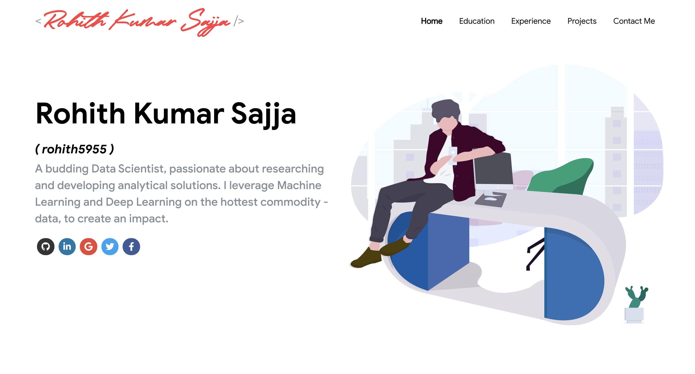

# Responsive Portfolio Template

)

<!--  -->

## A Responsive website template for portfolio website

 
  <kbd>
  	<a href="https://rohithsajja.me" target="_blank">
		</img>
	</a>
  </kbd>

## License 

This project is licensed under the MIT License - [LICENSE.md](./LICENSE) 

## References  

Inspired from [Saad Pasta's Portfolio](https://github.com/saadpasta/developerFolio) and [Ashutosh Hathidara's Portfolio](https://github.com/ashutosh1919/masterPortfolio).

Illustration vectors from [unDraw](undraw.co) and [Humaans](https://www.humaaans.com/) 
